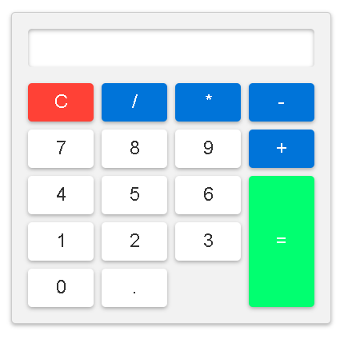

# Basit Hesap Makinesi

Bu proje, HTML, CSS ve JavaScript kullanarak basit bir hesap makinesi oluşturmayı amaçlar. Hesap makinesi, dört işlem yapabilir ve tarayıcıda çalışabilir.

## Örnek Görüntü

## Nasıl Kullanılır

Hesap makinesi oldukça basit bir arayüze sahiptir. Butonlara tıkladığınızda, sayılar ve işleçler ekrandaki sonuç kutusuna yansıtılır.

- **"C" Butonu**: Temizleme işlemi yapar.
- **"=" Butonu**: İşlemi hesaplar.
- Sayı butonları: Sırasıyla 0'dan 9'a kadar olan sayıları temsil eder.
- İşlem butonları: Toplama, çıkarma, çarpma ve bölme işlemlerini gerçekleştirir.
- "." Butonu: Ondalık sayıları girmek için kullanılır.

## Kurulum

1. Bu depoyu klonlayın.
2. Tarayıcınızda `index.html` dosyasını açın.

## Nasıl Çalışır

- Hesap makinesini çalıştırmak için tarayıcınızda `index.html` dosyasını açmanız yeterlidir.

## Geliştirme Ortamı

Bu projeyi geliştirmek için herhangi bir kurulum yapmanıza gerek yoktur. Bir metin düzenleyici ve tarayıcı yeterlidir.

## Katkıda Bulunma

1. Bu depoyu forklayın.
2. Yeni bir branch oluşturun: `git checkout -b yeni-ozellik`
3. Değişikliklerinizi kaydedin: `git commit -m 'Yeni özellik eklendi'`
4. Branch'inizi gönderin: `git push origin yeni-ozellik`
5. Bir pull request oluşturun.

## Lisans
---